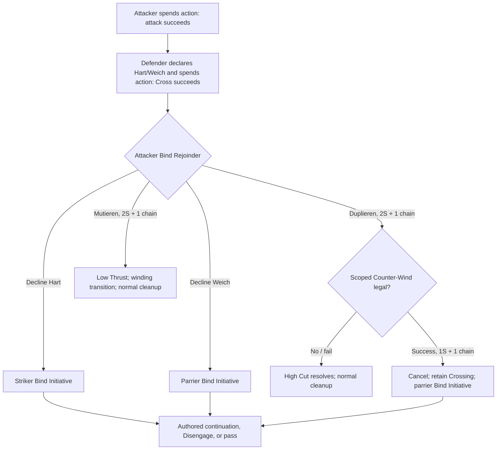

# General Bind Information Architecture v0.1 Results

Status: **PROVISIONAL bounded candidate experiment; no governing or canonical promotion.**

## Executive Result

H1 is mechanically coherent but does **not yet justify replacing R0**. Authored Hart/Weich creates a readable hidden information axis and the narrow attacker Bind Rejoinder cleanly gives Duplieren/Mutieren their post-parry timing without a second normal action. The blocking comparison is defender-side value: Hart has an exact Parry Boon, while Weich's Bind Initiative has no adjudicated downstream consumer in this bounded repertoire. **DEFENDER PRESSURE MIXING NOT YET EVALUABLE.**

Graduated wrong-read Bane becomes weak at high Skill: at Skill 18 it still succeeds 81.0%, versus 99.0% with the correct Boon. Hard failure preserves the information lesson and makes F1 a real efficiency choice at central priors, but remains punitive and unpromoted. F0 collapses guessing; F2 is never more Spiritus-efficient than the best blind choice in the tested grid. The scoped Counter-Wind uses existing operators, but its normal defence roll suppresses 50-90% of otherwise resolving eligible Duplieren branches across Skills 10-18.

## Source-of-Truth Check

The worktree was clean before the task. Atra Melee Design Packet v0.4, the governing register/YAML, Melee Mechanical Effect Vocabulary v0.1, Crossing/Bind v0.1, Bind Continuations v0.1, Incentive Integrity v0.1, Guard Evidence & Repertoire v0.1, the current audited Play records, the shared selector, authoritative engine, and prior repair artifacts were inspected. The prior repair suite passed **81/81** before candidate work. No material unexplained baseline conflict was found.

Repository evidence does not contain standalone Fühlen or Zucken Play records. Fühlen is audited through the Winden witness at Pseudo-Peter von Danzig ff. 37r.2-38v.1. Duplieren/Mutieren and the exact counter-winding remain `needs-item-level-audit`; the candidate uses the Project's supplied adjudication but does not invent or promote an exact locator.

## Control Architecture Preserved

The authoritative shared engine and governing records were not edited. R0 retains state-based D1, threatening-point denial, Cross/Beat, GC1, Committed timing, repaired Nachreisen, Zornhau point threat, Favored/Unfavored, current Fühlen, Ort/Winden candidates, C2/S2/T1/P1, Bind Initiative, and cap 3. H1 lives only in `simulations/general_bind_information_v0_1/` and its prototype overlay.

## Historical Boundary

The historical layer supports Hart/Weich bind opposition, Fühlen as sensing and acting Indes, Duplieren toward strong opposition, Mutieren toward weak opposition with winding, and Winden as a broader family. Hart Boon, Weich initiative, secret pre-roll authoring, Spiritus prices, wrong-read Bane/failure, and the exact Bind Rejoinder window are explicitly Atra abstractions.

## R0 Favored/Unfavored Control

R0 derives Favored/Unfavored from the two successful rolls creating a contested Crossing, keeps Bind Initiative separate, and lets current passive Fühlen reveal the categorical relation. It adds no extra roll, but the information axis is roll-derived rather than authored pressure.

## H1 Authored Hart/Weich Candidate

For ordinary Basic Cross only, the parrier authors hidden Hart or Weich before the Cross roll. A failed Cross writes no pressure. A successful H1 Cross writes Crossing and the declared pressure, leaves Favored/Unfavored Unknown, and opens one attacker Bind Rejoinder. Specialized creators such as Zornhau remain unchanged.

## Hart vs Weich Defensive Trade

Hart uses exactly one Parry Boon; Weich is flat. Hart's immediate success advantage is therefore exact and Skill-dependent. Weich's benefit is sequencing rather than a modifier, but that sequencing cannot be priced in this bounded scenario without an actual continuation.

## Bind Rejoinder Timing

The successful initial Cross has spent both fighters' normal actions. The original attacker may nevertheless declare only Duplieren or Mutieren as an authored no-additional-action continuation. Declining closes the window. Arbitrary Plays are not legal, and the continuation never refreshes or spends another normal action.

## Bind Initiative After Hart/Weich

After decline, Hart gives Bind Initiative to the original striker and Weich to the parrier. Initiative has no numeric modifier. If the holder lacks an authored continuation, only Disengage or pass is available; two consecutive passes end contact.

## Fühlen F0/F1/F2

F1 costs 1S once per bind, consumes no action or learned-chain entry, and reveals only Hart/Weich/Unknown. Because Spiritus has no assigned damage-equivalent, `best response` is reported under separate damage-maximizing and damage-per-Spiritus objectives plus Pareto frontiers. The symbolic threshold is retained rather than filled with a utility constant.

Under G, pay when `min(q,1-q) * 4.5 * (Pboon-Pbane) > lambda * F-cost`. Under F, replace the probability difference with `Pboon`. Here `lambda` is the player's unassigned marginal value of one Spiritus. F0 has the same D/M spend as blind play and strictly improves information at every non-extreme prior, collapsing guessing. F2 improves damage but is never more efficient than the best blind choice in the tested grid (ties only at the exact 50/50 hard-failure boundary).

| Model | Skill | F cost | Raw-damage purchase rate | Damage/S purchase rate |
|---|---:|---:|---:|---:|
| G | 10 | 0 | 100.0% | 100.0% |
| G | 10 | 1 | 100.0% | 20.0% |
| G | 10 | 2 | 100.0% | 0.0% |
| G | 12 | 0 | 100.0% | 100.0% |
| G | 12 | 1 | 100.0% | 0.0% |
| G | 12 | 2 | 100.0% | 0.0% |
| G | 14 | 0 | 100.0% | 100.0% |
| G | 14 | 1 | 100.0% | 0.0% |
| G | 14 | 2 | 100.0% | 0.0% |
| G | 18 | 0 | 100.0% | 100.0% |
| G | 18 | 1 | 100.0% | 0.0% |
| G | 18 | 2 | 100.0% | 0.0% |
| F | 10 | 0 | 100.0% | 100.0% |
| F | 10 | 1 | 100.0% | 60.0% |
| F | 10 | 2 | 100.0% | 20.0% |
| F | 12 | 0 | 100.0% | 100.0% |
| F | 12 | 1 | 100.0% | 60.0% |
| F | 12 | 2 | 100.0% | 20.0% |
| F | 14 | 0 | 100.0% | 100.0% |
| F | 14 | 1 | 100.0% | 60.0% |
| F | 14 | 2 | 100.0% | 20.0% |
| F | 18 | 0 | 100.0% | 100.0% |
| F | 18 | 1 | 100.0% | 60.0% |
| F | 18 | 2 | 100.0% | 20.0% |

Purchase rates are the fraction of the five controlled priors at which buying information is rational under the named deterministic objective. They are not behavioral probabilities. Under G/F1, only Skill 10 at Hart 50% ties on damage/S; higher Skills have 0% efficiency purchase. Under F/F1, the exact efficiency interval is Hart `1/3 <= q <= 2/3`, producing the 60% grid rate at 40/50/60%. Blind D/M switches at Hart 50%. Raw-damage choice buys Fühlen at every tested non-extreme prior for F1/F2 because no Spiritus value is included in that objective.

## Duplieren

Duplieren is the high Cut branch of one paired learned item. It requires Wide Crossing and the Bind Rejoinder, costs 2S, uses one chain entry, and deals normal damage. G maps Hart/Boon and Weich/Bane; F maps Hart/Boon and Weich/failure after spend. It adds no chip damage, response restriction, Open, damage modifier, or automatic retention.

## Mutieren

Mutieren is the low Thrust branch. It uses the same 2S/one-entry gate. G maps Weich/Boon and Hart/Bane; F maps Weich/Boon and Hart/failure after spend. It retains Crossing and sets point threat only through its winding transition; ordinary cleanup ends contact after resolution.

## Graduated Wrong-Read vs Hard Failure

G preserves an attack on a wrong read, but at Skill 18 the wrong Bane remains 81.0% successful and yields 3.645 expected damage. That is too reliable to carry the information game by itself. F makes wrong pressure a zero-output 2S spend, sharply raising information value. F is the stronger bounded information architecture, but its punishment and reserve effects require integrated testing before promotion.

## Skill Sensitivity

| Skill | Flat attack/parry | Boon attack/Hart parry | Bane attack | Boon-Bane | Boon/Bane | Correct damage | Wrong G damage | Wrong F |
|---:|---:|---:|---:|---:|---:|---:|---:|---:|
| 10 | 50.0% | 75.0% | 25.0% | 50.0% | 3.00x | 3.375 | 1.125 | 0.000 |
| 12 | 60.0% | 84.0% | 36.0% | 48.0% | 2.33x | 3.780 | 1.620 | 0.000 |
| 14 | 70.0% | 91.0% | 49.0% | 42.0% | 1.86x | 4.095 | 2.205 | 0.000 |
| 18 | 90.0% | 99.0% | 81.0% | 18.0% | 1.22x | 4.455 | 3.645 | 0.000 |

The absolute correct/wrong swing peaks in the middle of the Skill curve and shrinks at high Skill. Relative to the correct Boon, Bane removes 66.7%, 57.1%, 46.2%, and only 18.2% of success at Skills 10/12/14/18.

## Pressure-Prior Best Responses

`Damage best` maximizes expected damage and breaks equal-damage ties toward lower spend. `Efficiency best` maximizes damage/S. Neither is asserted as the game's universal utility. D = blind Duplieren, M = blind Mutieren, Fü = buy F1, X = decline.

| Model | Skill | Hart | D dmg/S | M dmg/S | Fü dmg/S | Best blind success/dmg/S | Fü success/dmg/S | Damage best | Efficiency best | Fü gain | Wrong probability / zero-output S |
|---|---:|---:|---:|---:|---:|---|---|---|---|---:|---:|
| G | 10 | 20.0% | 0.788 | 1.463 | 1.125 | 65.0%/2.925/2 | 75.0%/3.375/3 | Fü | M | 0.450 | 20.0%/0.000 |
| G | 10 | 40.0% | 1.013 | 1.237 | 1.125 | 55.0%/2.475/2 | 75.0%/3.375/3 | Fü | M | 0.900 | 40.0%/0.000 |
| G | 10 | 50.0% | 1.125 | 1.125 | 1.125 | 50.0%/2.250/2 | 75.0%/3.375/3 | Fü | D/M/Fü | 1.125 | 50.0%/0.000 |
| G | 10 | 60.0% | 1.237 | 1.013 | 1.125 | 55.0%/2.475/2 | 75.0%/3.375/3 | Fü | D | 0.900 | 40.0%/0.000 |
| G | 10 | 80.0% | 1.463 | 0.787 | 1.125 | 65.0%/2.925/2 | 75.0%/3.375/3 | Fü | D | 0.450 | 20.0%/0.000 |
| G | 12 | 20.0% | 1.026 | 1.674 | 1.260 | 74.4%/3.348/2 | 84.0%/3.780/3 | Fü | M | 0.432 | 20.0%/0.000 |
| G | 12 | 40.0% | 1.242 | 1.458 | 1.260 | 64.8%/2.916/2 | 84.0%/3.780/3 | Fü | M | 0.864 | 40.0%/0.000 |
| G | 12 | 50.0% | 1.350 | 1.350 | 1.260 | 60.0%/2.700/2 | 84.0%/3.780/3 | Fü | D/M | 1.080 | 50.0%/0.000 |
| G | 12 | 60.0% | 1.458 | 1.242 | 1.260 | 64.8%/2.916/2 | 84.0%/3.780/3 | Fü | D | 0.864 | 40.0%/0.000 |
| G | 12 | 80.0% | 1.674 | 1.026 | 1.260 | 74.4%/3.348/2 | 84.0%/3.780/3 | Fü | D | 0.432 | 20.0%/0.000 |
| G | 14 | 20.0% | 1.291 | 1.858 | 1.365 | 82.6%/3.717/2 | 91.0%/4.095/3 | Fü | M | 0.378 | 20.0%/0.000 |
| G | 14 | 40.0% | 1.480 | 1.669 | 1.365 | 74.2%/3.339/2 | 91.0%/4.095/3 | Fü | M | 0.756 | 40.0%/0.000 |
| G | 14 | 50.0% | 1.575 | 1.575 | 1.365 | 70.0%/3.150/2 | 91.0%/4.095/3 | Fü | D/M | 0.945 | 50.0%/0.000 |
| G | 14 | 60.0% | 1.669 | 1.480 | 1.365 | 74.2%/3.339/2 | 91.0%/4.095/3 | Fü | D | 0.756 | 40.0%/0.000 |
| G | 14 | 80.0% | 1.858 | 1.291 | 1.365 | 82.6%/3.717/2 | 91.0%/4.095/3 | Fü | D | 0.378 | 20.0%/0.000 |
| G | 18 | 20.0% | 1.904 | 2.147 | 1.485 | 95.4%/4.293/2 | 99.0%/4.455/3 | Fü | M | 0.162 | 20.0%/0.000 |
| G | 18 | 40.0% | 1.984 | 2.066 | 1.485 | 91.8%/4.131/2 | 99.0%/4.455/3 | Fü | M | 0.324 | 40.0%/0.000 |
| G | 18 | 50.0% | 2.025 | 2.025 | 1.485 | 90.0%/4.050/2 | 99.0%/4.455/3 | Fü | D/M | 0.405 | 50.0%/0.000 |
| G | 18 | 60.0% | 2.066 | 1.984 | 1.485 | 91.8%/4.131/2 | 99.0%/4.455/3 | Fü | D | 0.324 | 40.0%/0.000 |
| G | 18 | 80.0% | 2.147 | 1.904 | 1.485 | 95.4%/4.293/2 | 99.0%/4.455/3 | Fü | D | 0.162 | 20.0%/0.000 |
| F | 10 | 20.0% | 0.338 | 1.350 | 1.125 | 60.0%/2.700/2 | 75.0%/3.375/3 | Fü | M | 0.675 | 20.0%/0.400 |
| F | 10 | 40.0% | 0.675 | 1.012 | 1.125 | 45.0%/2.025/2 | 75.0%/3.375/3 | Fü | Fü | 1.350 | 40.0%/0.800 |
| F | 10 | 50.0% | 0.844 | 0.844 | 1.125 | 37.5%/1.688/2 | 75.0%/3.375/3 | Fü | Fü | 1.688 | 50.0%/1.000 |
| F | 10 | 60.0% | 1.012 | 0.675 | 1.125 | 45.0%/2.025/2 | 75.0%/3.375/3 | Fü | Fü | 1.350 | 40.0%/0.800 |
| F | 10 | 80.0% | 1.350 | 0.337 | 1.125 | 60.0%/2.700/2 | 75.0%/3.375/3 | Fü | D | 0.675 | 20.0%/0.400 |
| F | 12 | 20.0% | 0.378 | 1.512 | 1.260 | 67.2%/3.024/2 | 84.0%/3.780/3 | Fü | M | 0.756 | 20.0%/0.400 |
| F | 12 | 40.0% | 0.756 | 1.134 | 1.260 | 50.4%/2.268/2 | 84.0%/3.780/3 | Fü | Fü | 1.512 | 40.0%/0.800 |
| F | 12 | 50.0% | 0.945 | 0.945 | 1.260 | 42.0%/1.890/2 | 84.0%/3.780/3 | Fü | Fü | 1.890 | 50.0%/1.000 |
| F | 12 | 60.0% | 1.134 | 0.756 | 1.260 | 50.4%/2.268/2 | 84.0%/3.780/3 | Fü | Fü | 1.512 | 40.0%/0.800 |
| F | 12 | 80.0% | 1.512 | 0.378 | 1.260 | 67.2%/3.024/2 | 84.0%/3.780/3 | Fü | D | 0.756 | 20.0%/0.400 |
| F | 14 | 20.0% | 0.409 | 1.638 | 1.365 | 72.8%/3.276/2 | 91.0%/4.095/3 | Fü | M | 0.819 | 20.0%/0.400 |
| F | 14 | 40.0% | 0.819 | 1.228 | 1.365 | 54.6%/2.457/2 | 91.0%/4.095/3 | Fü | Fü | 1.638 | 40.0%/0.800 |
| F | 14 | 50.0% | 1.024 | 1.024 | 1.365 | 45.5%/2.047/2 | 91.0%/4.095/3 | Fü | Fü | 2.047 | 50.0%/1.000 |
| F | 14 | 60.0% | 1.228 | 0.819 | 1.365 | 54.6%/2.457/2 | 91.0%/4.095/3 | Fü | Fü | 1.638 | 40.0%/0.800 |
| F | 14 | 80.0% | 1.638 | 0.409 | 1.365 | 72.8%/3.276/2 | 91.0%/4.095/3 | Fü | D | 0.819 | 20.0%/0.400 |
| F | 18 | 20.0% | 0.446 | 1.782 | 1.485 | 79.2%/3.564/2 | 99.0%/4.455/3 | Fü | M | 0.891 | 20.0%/0.400 |
| F | 18 | 40.0% | 0.891 | 1.337 | 1.485 | 59.4%/2.673/2 | 99.0%/4.455/3 | Fü | Fü | 1.782 | 40.0%/0.800 |
| F | 18 | 50.0% | 1.114 | 1.114 | 1.485 | 49.5%/2.228/2 | 99.0%/4.455/3 | Fü | Fü | 2.228 | 50.0%/1.000 |
| F | 18 | 60.0% | 1.337 | 0.891 | 1.485 | 59.4%/2.673/2 | 99.0%/4.455/3 | Fü | Fü | 1.782 | 40.0%/0.800 |
| F | 18 | 80.0% | 1.782 | 0.445 | 1.485 | 79.2%/3.564/2 | 99.0%/4.455/3 | Fü | D | 0.891 | 20.0%/0.400 |

For all tested non-extreme priors, F1 maximizes raw expected damage. Under G it is generally less Spiritus-efficient, especially as Skill rises. Under F it is efficiency-rational at Hart 40/50/60% and blind play is more efficient at 20/80%. These are deterministic objective-specific choices, not a claim that one objective is canonical.

## Is Defender Hart/Weich Mixing Actually Evaluable?

**DEFENDER PRESSURE MIXING NOT YET EVALUABLE.** Hart's Boon is quantified. Weich creates Bind Initiative, but no adjudicated defender-side continuation in this bounded scenario realizes its value. Importing W1/W2, inventing a Vor bonus, or assigning initiative a utility constant would fake the comparison. Observed/controlled pressure frequencies therefore do not establish a rational defender mix.

## Counter-Wind

Counter-Wind is legal only after eligible Duplieren, costs 1S and one chain entry, and uses the normal Longsword defence test. Success cancels, retains Crossing, transfers Bind Initiative, and deals no damage. Failure leaves Duplieren's modifier unchanged. It is not legal against Mutieren.

| Skill | Normal defence | Correct D damage: none / Counter-Wind | Eligible Duplieren suppressed | Retained Crossing | Initiative transfer |
|---:|---:|---:|---:|---:|---:|
| 10 | 50.0% | 3.375 / 1.688 | 50.0% | 50.0% | 50.0% |
| 12 | 60.0% | 3.780 / 1.512 | 60.0% | 60.0% | 60.0% |
| 14 | 70.0% | 4.095 / 1.229 | 70.0% | 70.0% | 70.0% |
| 18 | 90.0% | 4.455 / 0.445 | 90.0% | 90.0% | 90.0% |

With 0S, known Counter-Wind changes nothing. With 1S+ and forced declaration, incoming Duplieren damage is multiplied by the Counter-Wind failure rate. This is meaningful counterplay but very strong at Skill 18; without an integrated reserve loop it cannot be called mandatory or healthy merely from immediate damage reduction.

## Response Economy

The parrier's ordinary Cross/Beat/Counter is unavailable against D/M because that action was spent on the initial Cross. This is action economy, not `RESTRICT_RESPONSE`. Counter-Wind is an explicit no-additional-action bind counter. No branch refreshes either fighter's normal action.

| Branch state | Normal actions spent | Spiritus delta | Chain delta | Contact / measure | Pressure / point | Bind Initiative | Next declarations |
|---|---|---|---|---|---|---|---|
| H1 Cross succeeds | attacker yes; parrier yes | 0 / 0 | 0 / 0 | Crossing / Wide | authored Hart/Weich; no automatic point | none during Rejoinder | D, M, decline |
| Decline Hart | unchanged | 0 / 0 | 0 / 0 | Crossing / Wide | Hart; point unchanged | striker | authored bind continuation, Disengage, pass |
| Decline Weich | unchanged | 0 / 0 | 0 / 0 | Crossing / Wide | Weich; point unchanged | parrier | authored bind continuation, Disengage, pass |
| Duplieren resolves | no new action | attacker -2S | attacker +1 | normal cleanup -> none / Wide | pressure clears; point unchanged | none | exchange aftermath |
| Mutieren resolves | no new action | attacker -2S | attacker +1 | retained during wind, then none / Wide | pressure clears; attacker point threatening | none | exchange aftermath |
| Counter-Wind succeeds | no new action | defender -1S in addition | defender +1 | Crossing retained / Wide | pressure preserved; point unchanged | defender | authored bind continuation, Disengage, pass |
| Counter-Wind fails | no new action | defender -1S in addition | defender +1 | Crossing until D resolves / Wide | pressure preserved until cleanup | none | resolve unchanged D |

## Geometry / Largo-Stretto Boundary

Measure, per-fighter contact zone, pressure, point threat, and Crossing remain independent. Middle contact stays compatible with Wide; low guard does not imply Close. No generic 1S Wide-to-Close purchase exists. T1 remains the distinct authored Tutta transition.

## Spiritus and Chain Pressure

Basic Cross is 0 entries; Fühlen 0; one D/M branch 1; Counter-Wind 1. The fourth learned Play remains illegal. At 2S, D/M buys correct-read Boon plus a new attack after the initiating action is already spent. That action compression is its strongest price justification. At 1S its correct damage/S doubles, making it conspicuously favorable beside 1S Nachreisen; at 2S it sits nearer C2's compound benchmark, though C2 also cancels and D/M instead occupies post-action continuation timing.

## R0 vs H1 Architecture Comparison

| Dimension | R0 Favored/Unfavored | H1 Hart/Weich |
|---|---|---|
| Historical intelligibility | abstract roll-derived blade relation | authored pressure directly teaches Hart/Weich |
| Hidden axes | hidden categorical relation; pressure separate/usually unknown | hidden authored pressure; Favored/Unfavored absent for H1 Basic Cross |
| Extra rolls | none | none |
| Decisions | roll outcome is not chosen | parrier chooses Hart/Weich; striker may read/guess |
| Fühlen | free passive relation visibility | priced pressure information candidate |
| Wrong-read risk | hidden-prerequisite risk in Ort/W1 | explicit D/M Bane or failure |
| Policy dependence | relation generated mechanically | defender mixing depends on unrealized initiative value |
| State authoring | comparable rolls | declaration that becomes state only on success |
| Explanation | lower successful roll is Favored | Hart secures Cross; Weich seeks initiative |
| Extensibility | supports current Ort/Winden relation | natural axis for D/M and future audited bind lessons |
| Zornhau compatibility | current local Favored/Ort/Winden sequence | left separate; no forced symmetry |

H1 is clearer historically and creates more authored decisions, but it currently leaves a one-sided defensive trade. It should not supersede R0 until Weich/Bind Initiative has actual defender-side consequences.

## Zornhau Compatibility

Zornhau remains on its threatening-point Favored/Unfavored Ort/Winden candidate sequence. H1 does not rewrite it. If H1 is later adopted, the Project must decide whether Zornhau translates to Hart/Weich or retains a local relation; this experiment provides no basis to force either answer.

## Remaining Historical / Mechanical Gaps

Duplieren/Mutieren and the exact counter-winding need item-level locators in durable records. Weich needs one actual defender-side Bind-Initiative consumer. The current response economy after an action-spent Cross is intentionally sparse. Integrated reserve competition is needed to judge F1, 2S D/M, and 1S Counter-Wind. No generic Leverage, Largo-to-Stretto purchase, universal Winden, Zucken, or other deferred action was added.

## Project Recommendation

Keep R0 governing-provisional. Retain H1 plus the narrow Bind Rejoinder as promising candidates. Prefer hard failure over Bane for the next controlled test because Bane is too weak at Skill 18 and F1 otherwise loses practical information value. Keep F1 and 2S D/M as the next-test prices. Keep Counter-Wind candidate-only: it is clean but may suppress Duplieren too strongly at high Skill. Do not add Leverage.

## Exact Next Milestone

Run **another bind-repertoire increment**, not promotion, full-duel cleanup, or Named Guard v0.2: perform an item-level audit and implement one narrow defender-side continuation that consumes Weich-earned Bind Initiative. Zucken is a plausible research target only if exact evidence supports the scoped timing; do not add generic Zucken by inference. Then rerun H1 with actual defender-side consequences and integrated Spiritus opportunity costs.

## Required Project Decision Table

| Question | Candidate A | Candidate B | Result | Recommendation |
|---|---|---|---|---|
| Ordinary bind information | R0 Favored/Unfavored | H1 Hart/Weich | H1 clearer; Weich value incomplete | keep R0; continue H1 |
| Fühlen price | 0S | 1S | 0S collapses guessing; 1S creates trade under F | F1 next-test candidate |
| Fühlen high-price control | 1S | 2S | F2 never wins efficiency in grid | do not advance F2 |
| Wrong pressure | Bane | failure | Bane remains 81% at Skill 18 | F for next integrated test |
| D/M price | 1S | 2S | 1S highly efficient; 2S reflects action compression | retain 2S candidate |
| Attacker timing | no Rejoinder | narrow Bind Rejoinder | clean, no second action leakage | retain candidate |
| Winden response | none | scoped Counter-Wind vs Duplieren | clean but 50-90% suppression | retain only for integrated test |

## Final Project-Review Questions

1. **Yes.** The existing governing engine remained behaviorally unchanged.
2. **Yes.** H1 authors Hart/Weich without random generation.
3. **Probably yes in the bounded repertoire.** Hart has quantified defence; Weich's payoff is unrealized.
4. **No.** Weich lacks enough rules-real value here.
5. **Not evaluable;** more defender-side bind repertoire is required.
6. **Yes.** The narrow Rejoinder cleanly supplies D/M timing.
7. **No.** It creates no normal-action refresh or second action.
8. **Yes.** Duplieren is high Cut/Hart; Mutieren is winding low Thrust/Weich.
9. **Yes:** Hart -> Duplieren; Weich -> Mutieren.
10. **No.** Bane still succeeds 81% at Skill 18.
11. **For this information test, yes provisionally;** hard failure needs reserve testing.
12. **Neither categorically.** F makes F1 damage-optimal centrally; resource objectives preserve blind play at outer priors.
13. **G makes paid Fühlen close to irrelevant at high Skill under efficiency; not under raw damage maximization.**
14. **Only with F.** F1 is the healthiest tested price across the grid when wrong reads fail.
15. **Yes.** F0 collapses guessing at equal D/M spend.
16. **For Spiritus efficiency, effectively yes.** F2 never beats blind play in the tested grid.
17. **Plausibly.** 2S is justified primarily by post-action attack compression, but is not promoted.
18. **It provides useful counterplay but may over-suppress Duplieren at high Skill.**
19. **No.** Existing CANCEL, RETAIN, SET, normal test, timing, and chain operations suffice.
20. **Yes.** Generic Leverage remains rejected/deferred.
21. **Yes.** Generic Largo-to-Stretto spending remains rejected/deferred.
22. **Not yet.** H1 is more intelligible but not a complete rational defender architecture.
23. **The missing mechanic is one actual defender-side continuation that converts Weich-earned Bind Initiative into consequences.**
24. **Keep H1 isolated; do not replace or coexist in governing play yet.**
25. **One item-level-audited defender-side Weich/initiative continuation; research Zucken only if supported.**
26. **Another bind repertoire increment.**

STOP for Project adjudication. No candidate is promoted.
